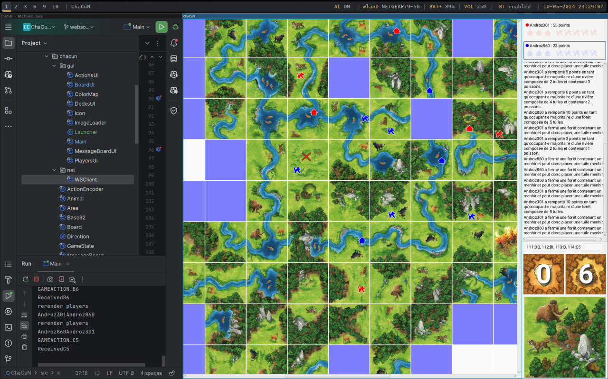
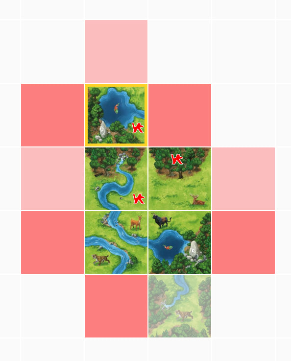

# ChaCuN (CS-108)

Ce projet est une version électronique du jeu Chasseurs et cueilleurs au Néolithique, abrégé **ChaCuN**, pour le cours CS-108 à l'EPFL.

L'énoncé se trouve [ici](https://cs108.epfl.ch/archive/24/p/00_introduction.html).

Les fonctionnalités et API décrites ci-dessous correspondent à des rendus bonus.

## Mode multijoueur

Notre version de ChaCuN permet de joueur à plusieurs, d'échanger des messages directement dans le jeu, et contient plusieurs améliorations graphiques.

L'objectif n'est pas d'ajouter de nouvelles règles mais de rendre les parties de ChaCuN beaucoup plus agréables à jouer en pratique.

Toutes les communications utilisées pour jouer à plusieurs fonctionnent par Websocket. Le client est situé dans le sous-paquetage `ch.epfl.chacun.net`.

Il communique avec le serveur hébergé à **wss://cs108-chacun-ws-server.sys.polysource.ch**.

### Rejoindre une partie

Il est possible de rejoindre une partie en se connectant au serveur via cet endpoint:
`wss://cs108-chacun-ws-server.sys.polysource.ch?username=USERNAME&gameId=GAMEID`.

C'est ce que fait le client lorsqu'il est lancé, en lisant le paramètre `--player` et `--game`.

Une fois connecté, vous recevrez un message du serveur vous indiquant si vous avez bien rejoint la partie, suivi des pseudos des autres joueurs triés dans l'ordre d'arrivée (le vôtre sera donc à la fin).

⬇️ `GAMEJOIN_ACCEPT.Username1,Username2,Username3`

> La seed à utiliser pour mélanger les decks est le hash code de la chaîne de caractères représentant l'identifiant de partie.

Une méthode publique à `GameState` a été ajouté, `withPlayers` qui permet de recréer un `GameState` avec des joueurs différents, et une méthode `withTextMaker` qui permet de remplacer le `TextMaker` par un autre avec les nouveaux noms. Ainsi, le `GameState` reste immuable. De même, une valeur observable du `GameState` est passée à `PlayersUI`.

Une valeur observable `isLocalPlayerCurrentPlayer` a été ajoutée à quelques classes du GUI pour savoir si le joueur local est celui qui doit jouer.

### Rester connecté

Pour rester connecté, vous devez répondre au message de ⬇️ `PING` du serveur en renvoyant ⬆️ `PONG`.

### Envoi et réception des actions

Lorsqu'un joueur effectue une action, vous devez envoyer ⬆️ `GAMEACTION.code` où `code` représente l'action encodée en base 32 selon les spécifications de l'énoncé.

Notez que le serveur vérifie que le joueur qui envoie une action a bien l'autorisation de le faire (dans le sens où c'est bien son tour).

Le client dispose aussi de cette information et n'affiche pas la frange, ne permet pas de récupérer des occupants ni de poser des tuiles si le joueur local n'est pas celui qui doit joueur à ce moment-là.

### Envoi et réception des messages

Lorsqu'un joueur souhaite envoyer un message (via l'entrée supplémentaire située sous le `MessageBoard`), vous devez envoyer ⬆️ `GAMEMSG.content` où `content` est TODO.

Vous et les autres joueurs recevez en réponse ⬇️ `GAMEMSG.username=content` où `username=content` est TODO.

Pour cela, une classe `MessageBoardChatUI` a été ajoutée, une méthode publique `withGameChatMessage` à `MessageBoard` et à `GameState` permettant d'ajouter un message à la liste des messages.

### Amélioration de l'affichage des tuiles

Les parties sont assez longues car il faut un certain de temps de réflexion avant de placer une tuile. Pour aider les joueurs, nous avons ajouté des informations sur les tuiles qui permettent de savoir si elles peuvent être placées à un endroit donné.

- ajout d'une méthode publique `boolean couldPlaceTileAtPos` qui permet d'afficher à l'utilisateur s'il existe une rotation quelconque qui permettrait de placer une tuile à une position donnée
- l'opacité des positions d'insertions sans rotation possible est réduite pour indiquer à l'utilisateur qu'il ne peut pas placer de tuile à cet endroit

Le jeu affiche aussi quelle tuile vient d'être placée par un joueur. C'est très utile quand le jeu est gros (souvent de + de 100 cartes) et que l'on joue en mode multijoueur.

