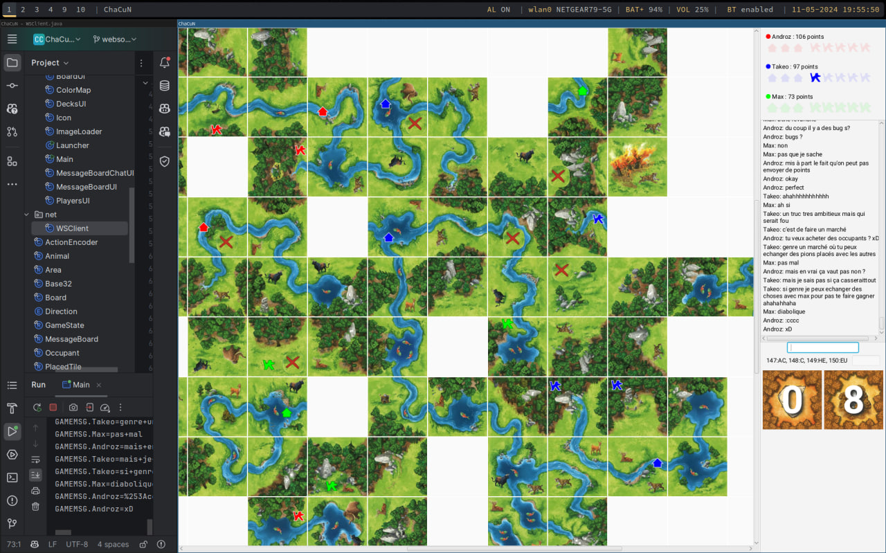

# ChaCuNE (CS-108)

Ce projet est une version électronique du jeu Chasseurs et cueilleurs au Néolithique, abrégé **ChaCuN**, pour le cours CS-108 à l'EPFL.  L'énoncé se trouve [ici](https://cs108.epfl.ch/archive/24/p/00_introduction.html).

Les fonctionnalités et API décrites ci-dessous correspondent à des rendus bonus. Notre version améliorée ChaCuNE permet de jouer à plusieurs, d'échanger des messages directement dans le jeu, et contient plusieurs améliorations graphiques.

## [Voir le rapport](./rapport.pdf)
